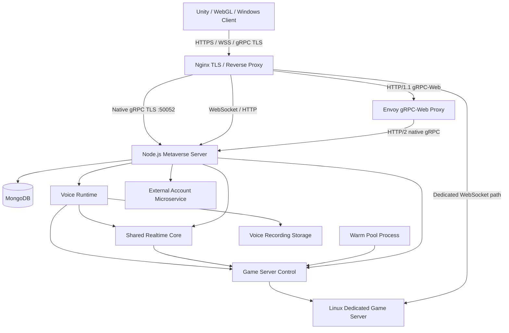

# Metaverse Production Server

> Production monorepo for the Metaverse backend, realtime services, Dedicated Game Server build, infrastructure configuration, deployment contract, voice runtime, recording services, and operational documentation.

---

## 1. Purpose of This Repository

This repository is the source-controlled production package for the Metaverse server stack.

It is intentionally broader than a normal Node.js repository. The system running in production is not only a Node.js process. It is a coordinated stack containing:

- the main Node.js backend;
- native gRPC services;
- gRPC-Web compatibility for WebGL;
- WebSocket realtime transport;
- native bidirectional gRPC realtime streaming;
- MongoDB persistence;
- authentication and token management;
- integration with the external account microservice;
- room and lobby management;
- Dedicated Game Server allocation and lifecycle control;
- warm Dedicated Game Server capacity;
- client tickets and Dedicated Server service tokens;
- the complete Linux Dedicated Game Server build used by the team;
- Nginx edge routing and TLS termination;
- Envoy gRPC-Web translation and JWT validation;
- PM2 process management;
- systemd service definitions;
- voice connection, routing, session, recording, directional policy, operational metrics, and NPC voice services;
- deployment mappings and production operating rules.

The repository therefore acts as the version-controlled source of truth for the production components that the server team maintains.

A Git commit is **not** considered a production deployment. Git and deployment are intentionally separated.

---

## 2. Repository Model

The repository uses one production monorepo.

```text
metaverse-production/
├── server/
│   ├── src/
│   ├── scripts/
│   ├── protos/
│   ├── docs/
│   ├── tools/
│   ├── package.json
│   ├── package-lock.json
│   └── .env.example
│
├── game-server/
│   └── LinuxGameServer/
│       ├── LinuxGameServer.x86_64
│       ├── LinuxGameServer_Data/
│       ├── UnityPlayer.so
│       └── native runtime libraries
│
├── infrastructure/
│   ├── nginx/
│   │   ├── nginx.conf
│   │   └── sites-available/
│   │       └── metaverse-server
│   ├── envoy/
│   │   └── envoy.vps.yaml
│   ├── pm2/
│   │   └── ecosystem.config.cjs
│   └── systemd/
│       ├── pm2-world3d.service
│       └── envoy-metaverse.service
│
├── deploy/
│   └── README.md
│
├── docs/
│   ├── FIRST_GITHUB_IMPORT.md
│   ├── REPOSITORY_CONTRACT.md
│   ├── REPOSITORY_SCOPE.md
│   ├── RUNTIME_BASELINE_2026-08-26.md
│   └── REMOVED_FROM_REPOSITORY_PACKAGE.txt
│
├── .gitignore
├── .gitattributes
└── README.md
```

The top-level separation is deliberate:

| Directory | Responsibility |
| --- | --- |
| `server/` | Main Node.js application and server-side business logic |
| `game-server/` | Complete generated Linux Dedicated Game Server build |
| `infrastructure/` | Nginx, Envoy, PM2, and systemd configuration |
| `deploy/` | Deployment contract and future validated deployment tooling |
| `docs/` | Runtime baseline, repository rules, Git import instructions, and audit documentation |

The repository does **not** mirror the Linux root filesystem. Infrastructure files are stored by responsibility and are mapped to their production destinations during deployment.

---

## 3. Audited Production Baseline

The current repository structure was built from direct audits of the running server.

Audited production baseline date:

```text
2026-08-26
```

Audited host/runtime:

| Component | Audited value |
| --- | --- |
| Operating system | Ubuntu 22.04.5 LTS |
| Kernel | Linux 5.15.0-185-generic |
| Node.js | v22.22.3 |
| npm | 10.9.8 |
| PM2 | 7.0.1 |
| Nginx | 1.18.0 |
| Envoy | 1.32.2 |
| MongoDB | 8.0.23 |
| FFmpeg | 4.4.2 |
| OpenSSL | 3.0.2 |
| Certbot | 1.21.0 |

Audited primary application runtime:

```text
/home/world3d/apps/metaverse-server
```

Audited main Node.js entry point:

```text
/home/world3d/apps/metaverse-server/src/index.js
```

Audited Dedicated Game Server runtime target:

```text
/home/world3d/apps/metaverse-linux-game-server-v0.33.8/LinuxGameServer
```

Audited Dedicated Game Server executable:

```text
LinuxGameServer.x86_64
```

Audited voice recording root:

```text
/home/world3d/data/metaverse-voice-recordings
```

Audited WebGL static build path:

```text
/var/www/metaverse-webgl
```

Audited completed-buildings JSON path:

```text
/var/www/html/completed-buildings.json
```

The exact runtime baseline is also recorded in:

```text
docs/RUNTIME_BASELINE_2026-08-26.md
```

---

## 4. High-Level Production Architecture



The most important architectural rule is that multiple client transports converge on shared server-side application logic rather than creating independent implementations for every platform.

---

# Part I — Main Application Server

## 5. Node.js Application

The Node.js application is under:

```text
server/
```

Its package is:

```text
metaverse-grpc-server
```

The package uses ES modules:

```json
"type": "module"
```

Current direct dependencies include:

- `@grpc/grpc-js`
- `@grpc/proto-loader`
- `bcryptjs`
- `dotenv`
- `jsonwebtoken`
- `mongoose`
- `uuid`
- `ws`

The production entry point is:

```text
server/src/index.js
```

The application startup is centralized in this file.

---

## 6. Application Startup Sequence

The production startup sequence implemented by `server/src/index.js` is important because it defines the dependency order between all major subsystems.

The current startup flow is:

1. Load environment configuration.
2. Validate application configuration.
3. Start application logging.
4. Connect to MongoDB.
5. Create or recover the permanent public 3D lobby in the database.
6. Read and log initial server statistics.
7. Start the periodic server-statistics timer.
8. Prepare Game Server Control authentication.
9. Create the raw HTTP adapter for Game Server Control.
10. Create the Dedicated-to-Voice session delta runtime.
11. Read the extended voice feature flag.
12. Create the main Node HTTP server.
13. Attach Game Server Control to the main runtime.
14. Start public-lobby Dedicated Server reconciliation.
15. Attach WebSocket realtime to the same HTTP server.
16. Register the permanent public lobby in the realtime Room Manager.
17. Attach the base voice runtime to the live realtime and Dedicated Server registries.
18. If the extended voice runtime is enabled:
    - initialize recording storage;
    - create voice recording services;
    - create voice operational metrics and audit services;
    - create routing and mute services;
    - create the voice transport runtime;
    - create NPC voice services;
    - connect Dedicated Server session events to routing and recording;
    - recover or quarantine interrupted recording state.
19. Create the native gRPC server.
20. Register native realtime gRPC streaming on the same gRPC server.
21. Register voice gRPC transport when enabled.
22. Register NPC voice gRPC publishing when enabled.
23. Start the main HTTP/WebSocket listener.
24. Register graceful shutdown for HTTP, gRPC, realtime, Game Server Control, public lobby reconciliation, and voice runtimes.

A fatal startup failure exits the process instead of leaving a partially initialized production runtime.

---

## 7. Configuration Layer

Configuration code is under:

```text
server/src/config/
```

Important files:

```text
server/src/config/env.js
server/src/config/tls.js
server/src/config/validation.js
```

Responsibilities include:

- reading environment variables;
- defining defaults;
- validating required runtime values;
- resolving TLS paths;
- parsing JWT lifetimes;
- defining gRPC and WebSocket ports;
- exposing typed configuration to the application.

The real production `.env` file is intentionally excluded from Git.

The repository contains only:

```text
server/.env.example
```

This file documents required keys without storing production secrets.

---

# Part II — Authentication and Identity

## 8. Authentication Architecture

Authentication is separated into domain, core, persistence, transport, and external-integration layers.

Relevant directories:

```text
server/src/domain/auth/
server/src/core/auth/
server/src/infra/mongo/models/
server/src/infra/mongo/models/repositories/
server/src/transport/grpc/
server/src/integrations/microservice/
```

This avoids placing all authentication responsibilities inside gRPC handlers.

---

## 9. Local Authentication

The local authentication service supports user identity, password hashing, JWT access tokens, refresh tokens, and logout/revocation.

Important files include:

```text
server/src/core/auth/auth.service.js
server/src/core/auth/token.service.js
server/src/domain/auth/passwordService.js
server/src/domain/auth/authErrors.js
```

Implemented responsibilities include:

- email normalization;
- username normalization;
- default username generation;
- duplicate-user handling;
- password hashing;
- password verification;
- user registration;
- login;
- access-token creation;
- refresh-token creation;
- refresh-token rotation;
- refresh-token revocation;
- logout;
- logout across all devices;
- protobuf-compatible user mapping.

Refresh token security is designed so that the raw refresh token is not stored as plain text in MongoDB. A hash is stored for later verification.

---

## 10. JWT Security

The repository uses asymmetric JWT configuration.

The environment template specifies:

```text
JWT_ALGORITHM=RS256
```

Separate access and refresh signing-key paths are supported.

The application also exposes the public-key endpoint:

```text
/.well-known/jwks.json
```

This endpoint is used by other trusted components, including Envoy JWT validation.

Private JWT keys must never be committed.

---

## 11. gRPC Authentication API

Authentication contracts are defined in:

```text
server/protos/auth/auth.proto
```

The `AuthService` contract currently contains RPCs for:

- `Register`
- `Login`
- `LoginWithMicroservice`
- `GetUserData`
- `GetMicroserviceUserData`
- `Logout`
- `LogoutAllDevices`

The main gRPC server loads the authentication and health protobuf definitions and registers them before binding the gRPC port.

---

## 12. External Account Microservice Integration

The application also integrates with an external account service.

Relevant code:

```text
server/src/integrations/microservice/
```

The integration is separated from the local authentication implementation.

Current responsibilities include:

- OAuth-style token acquisition;
- remote `/me` profile retrieval;
- completed-build-feature retrieval;
- token storage;
- token encryption support;
- profile persistence;
- request timeouts;
- HTTP/network error mapping;
- microservice-specific diagnostics and test utilities.

The HTTP client uses `AbortController`-based timeout handling and converts remote failures into explicit application errors.

Important configuration keys include:

```text
AUTH_MICROSERVICE_REPLACE_LOGIN_REGISTER
MICROSERVICE_TOKEN_URL
MICROSERVICE_ME_URL
MICROSERVICE_COMPLETED_BUILD_FEATURES_URL
MICROSERVICE_CLIENT_ID
MICROSERVICE_CLIENT_SECRET
MICROSERVICE_SCOPE
MICROSERVICE_TIMEOUT_MS
MICROSERVICE_TOKEN_ENCRYPTION_SECRET
```

`MICROSERVICE_CLIENT_SECRET` and `MICROSERVICE_TOKEN_ENCRYPTION_SECRET` are secrets and must never be stored in Git.

---

# Part III — MongoDB Persistence

## 13. MongoDB Layer

MongoDB integration is under:

```text
server/src/infra/mongo/
```

The connection entry point is:

```text
server/src/infra/mongo/connection.js
```

The repository currently contains models for:

```text
User
RefreshToken
Room
MicroserviceToken
MicroserviceProfile
```

Corresponding repository classes isolate database access from the application services.

This layer supports:

- user storage;
- refresh-token lifecycle;
- room directory persistence;
- external microservice token persistence;
- external microservice profile persistence.

Production MongoDB data is runtime data and is intentionally excluded from Git.

---

# Part IV — gRPC and WebGL Compatibility

## 14. Native gRPC Server

The native gRPC server is implemented under:

```text
server/src/transport/grpc/
```

The main gRPC listener uses the configured internal endpoint:

```text
0.0.0.0:50051
```

The gRPC server currently registers base services before binding and exposes a `beforeBind` hook so additional runtime services can be registered without replacing the existing authentication/health path.

This hook is used to attach:

- realtime bidirectional streaming;
- voice gRPC transport;
- NPC voice gRPC publishing.

---

## 15. Health gRPC Service

The health protobuf is:

```text
server/protos/health.proto
```

It defines:

```text
HealthService.Check
```

The health service is registered on the native gRPC server.

---

## 16. WebGL gRPC-Web Path

Browser/WebGL clients cannot use the native desktop gRPC path in the same way as native clients.

The production path therefore uses:

```text
WebGL
→ HTTPS
→ Nginx
→ HTTP/1.1 to Envoy on 127.0.0.1:8081
→ Envoy gRPC-Web filter
→ HTTP/2 native gRPC on 127.0.0.1:50051
```

Nginx currently proxies:

```text
/metaverse.v1.AuthService/
/metaverse.v1.HealthService/
```

to Envoy.

Envoy then forwards the request to the native gRPC backend.

This preserves one server-side service implementation while providing a browser-compatible transport.

---

## 17. Envoy Responsibilities

Production Envoy configuration is tracked under:

```text
infrastructure/envoy/envoy.vps.yaml
```

The audited Envoy listener is:

```text
127.0.0.1:8081
```

The audited native gRPC backend is:

```text
127.0.0.1:50051
```

The Envoy configuration includes:

- HTTP connection management;
- CORS handling;
- JWT authentication;
- gRPC-Web translation;
- routing to the native gRPC backend;
- a JWKS cluster pointing back to the Node application;
- Envoy administration on `127.0.0.1:9901`.

The systemd service runs Envoy with the production configuration deployed to:

```text
/home/world3d/apps/metaverse-server/envoy/envoy.vps.yaml
```

---

# Part V — Realtime System

## 18. Realtime Architecture

Realtime code is under:

```text
server/src/realTime/
```

The realtime system is designed around a shared application core instead of independent logic for WebSocket and gRPC.

The two main client transport families are:

| Client family | Realtime transport |
| --- | --- |
| WebGL | WebSocket |
| Native Windows / native-capable client | Bidirectional gRPC streaming |

Both are connected to shared runtime state, including:

- connection registry;
- Room Manager;
- realtime route registry;
- room membership;
- application route handlers.

This is important because realtime behavior should remain consistent regardless of client transport.

---

## 19. Realtime Protocol

Realtime protocol code is under:

```text
server/src/realTime/protocol/
```

The protocol defines channels and message types.

Current channels:

```text
system
presence
world
game
lobby
chat
voice
npc
```

Current route groups include:

### System

```text
auth
ping
ack
error
```

The protocol can also produce:

```text
auth_ok
auth_failed
pong
```

### Presence

```text
player_state
player_joined
player_left
room_members_request
room_members_snapshot
```

### Game

```text
join_room
leave_room
player_action
world_event
```

### Lobby

```text
create_room
list_rooms
room_created
room_updated
room_closed
```

### World

```text
object_spawn
object_update
object_despawn
```

### Chat

```text
message
typing
read
```

### NPC

```text
dialogue
action
```

The realtime route registry maps:

```text
channel + message type → handler
```

Unknown routes are rejected through the realtime routing layer rather than silently accepted.

---

## 20. Realtime Stability Layer

Stability code is under:

```text
server/src/realTime/stability/
```

Implemented components include:

### Heartbeat

Default heartbeat configuration in the realtime stability module:

```text
interval: 15000 ms
timeout: 30000 ms
```

The controller tracks ping/pong state and can terminate stale WebSocket connections.

### ACK Tracking

The ACK tracker maintains pending acknowledgements and timeout cleanup.

Current module defaults:

```text
ACK timeout: 5000 ms
cleanup interval: 10000 ms
```

### Flood Protection

The flood-protection module maintains per-source request/message buckets and can temporarily block abusive message rates.

### Disconnect Cleanup

Disconnect cleanup removes stale connection state and room membership after WebSocket close/error conditions.

These systems exist to avoid orphaned presence, unbounded pending ACKs, stale sockets, and uncontrolled message floods.

---

# Part VI — Rooms and Public Lobby

## 21. Room Manager

The in-memory Room Manager is implemented in:

```text
server/src/realTime/roomManager.js
```

It is responsible for:

- registered realtime rooms;
- room membership;
- joining and leaving rooms;
- user/connection lookup;
- broadcasting within rooms;
- permanent room definitions;
- automatic room cleanup where allowed.

Permanent rooms are treated differently from temporary rooms and are protected from normal automatic deletion.

---

## 22. Persistent Room Directory

Persistent room management is implemented through:

```text
server/src/realTime/lobby/roomDirectoryService.js
```

and MongoDB room persistence.

The directory service handles:

- room creation;
- room naming and validation;
- room visibility;
- player-capacity normalization;
- joinability state;
- online counts;
- room status;
- client-facing room mapping.

---

## 23. Public 3D Lobby

The public 3D lobby has dedicated startup logic.

Relevant files:

```text
server/src/realTime/lobby/publicLobbyStartupService.js
server/src/realTime/lobby/publicLobbyDedicatedReconciler.js
```

At application startup, the permanent public lobby is created or recovered from the database.

It is then registered as a permanent realtime room in the shared Room Manager.

The Dedicated reconciler periodically attempts to associate the permanent public lobby with an available Dedicated Game Server.

The audited reconciler interval configured in the application startup is:

```text
2000 ms
```

The design allows the public lobby room definition to survive application restarts while the active realtime runtime is rebuilt in memory.

---

# Part VII — Game Server Control

## 24. Purpose

Game Server Control is the management layer between the main backend, clients, and Linux Dedicated Game Server processes.

Code is under:

```text
server/src/gameServerControl/
```

It manages:

- Dedicated Server registration;
- server health;
- heartbeats;
- client allocation;
- tickets;
- Dedicated Server ticket verification;
- player session lifecycle;
- server service tokens;
- warm capacity;
- process launching;
- process manifests;
- capacity/resource policies.

---

## 25. Game Server Control Modules

Main subdirectories include:

```text
allocation/
auth/
handlers/
http/
registry/
routes/
security/
sessions/
tickets/
tools/
```

### `allocation/`

Selects an appropriate Dedicated Server for a request.

### `auth/`

Resolves client authentication for Game Server Control HTTP operations.

### `handlers/`

Separates client-side and Dedicated Server-side operations.

### `registry/`

Tracks registered servers and health information.

### `sessions/`

Tracks game sessions.

### `tickets/`

Creates, stores, validates, and consumes client connection tickets.

### `security/`

Implements service-token security for Dedicated Servers.

### `tools/`

Contains server launch, warm-pool, service-token, and test utilities.

---

## 26. Game Server Control HTTP API

The current route file registers 13 Game Server Control endpoints.

### General status

```text
GET /game-server-control/status
```

### Dedicated health/reporting

```text
GET /game-server-control/dedicated/report
GET /game-server-control/dedicated/health
GET /game-server-control/dedicated/status
```

### Client operations

```text
POST /game-server-control/client/ticket
GET /game-server-control/client/servers
GET /game-server-control/client/session
```

### Dedicated Server operations

```text
POST /game-server-control/dedicated/register
POST /game-server-control/dedicated/heartbeat
POST /game-server-control/dedicated/renew-service-token
POST /game-server-control/dedicated/verify-ticket
POST /game-server-control/dedicated/player-left
POST /game-server-control/dedicated/session-result
```

A separate voice-specific Dedicated Server endpoint is attached to the main HTTP runtime:

```text
/game-server-control/dedicated/voice-session-delta
```

Client user identity is resolved from authentication context rather than trusting a user ID supplied in an untrusted client body.

---

## 27. Dedicated Server Registration and Health

Dedicated Server state is managed through the Game Server registry and health store.

The system tracks whether servers are:

- registered;
- alive;
- healthy;
- available for allocation;
- associated with sessions/rooms;
- providing heartbeat updates.

The audited production heartbeat timeout is:

```text
15 seconds
```

A Dedicated Server that stops reporting within the configured health policy should no longer be treated as a valid normal allocation candidate.

---

## 28. Client Ticket Flow

The client-to-Dedicated connection flow is based on short-lived tickets.

Conceptually:

```text
Authenticated client
→ request game-server ticket
→ allocator selects/launches server
→ short-lived ticket returned
→ client connects to Dedicated Server
→ Dedicated Server verifies ticket with backend
→ game session is established
```

The audited ticket TTL is:

```text
60 seconds
```

Tickets are intentionally short lived to reduce the usefulness of copied/stale connection credentials.

---

## 29. Dedicated Server Service Tokens

Dedicated Servers use a separate service-token mechanism.

Important implementation:

```text
server/src/gameServerControl/security/gameServerServiceToken.js
```

The token implementation includes:

- signed payloads;
- server identity;
- purpose;
- issued time;
- expiry time;
- random nonce;
- bounded metadata;
- constant-time signature comparison;
- maximum TTL enforcement;
- service-secret strength validation;
- token renewal support.

The environment template requires a strong server-side secret and currently documents:

```text
GAME_SERVER_SERVICE_SECRET_MIN_LENGTH=64
GAME_SERVER_SERVICE_SECRET_REQUIRE_STRONG=true
GAME_SERVER_SERVICE_TOKEN_MAX_TTL_SECONDS=300
GAME_SERVER_SERVICE_TOKEN_RENEWAL_ENABLED=true
GAME_SERVER_SERVICE_TOKEN_RENEWAL_TTL_SECONDS=300
```

The actual service secret must never be committed.

---

## 30. Dedicated Server Allocation

The allocator is implemented in:

```text
server/src/gameServerControl/allocation/gameServerAllocator.js
```

The allocator considers:

- requested room;
- region;
- zone;
- reserved room capacity;
- free capacity;
- server health;
- preferred server when provided.

The implemented scoring weights are:

```text
room weight: 50
region weight: 30
zone weight: 20
capacity weight: 10
health weight: 100
```

Selection favors valid healthy capacity while also considering locality and requested room constraints.

The allocator also calculates capacity waste after allocation to choose the better candidate when scores are otherwise equal.

---

## 31. Auto Launch and Capacity

The environment template contains the audited production Game Server Control auto-launch policy.

Important values include:

```text
GAME_SERVER_AUTO_LAUNCH_ENABLED=true
GAME_SERVER_AUTO_LAUNCH_START_PORT=7777
GAME_SERVER_AUTO_LAUNCH_MAX_PORT_SCAN=20
GAME_SERVER_AUTO_LAUNCH_WAIT_MS=30000
GAME_SERVER_AUTO_LAUNCH_MAX_ACTIVE_SERVERS=10
GAME_SERVER_AUTO_LAUNCH_MAX_PENDING_LAUNCHES=2
GAME_SERVER_AUTO_LAUNCH_ROOM_COOLDOWN_MS=15000
```

Rate limiting is also represented in configuration:

```text
GAME_SERVER_TICKET_RATE_LIMIT_ENABLED=true
GAME_SERVER_TICKET_RATE_LIMIT_WINDOW_MS=10000
GAME_SERVER_TICKET_RATE_LIMIT_MAX=4

GAME_SERVER_AUTO_LAUNCH_RATE_LIMIT_ENABLED=true
GAME_SERVER_AUTO_LAUNCH_RATE_LIMIT_WINDOW_MS=60000
GAME_SERVER_AUTO_LAUNCH_RATE_LIMIT_MAX=7
```

---

## 32. Warm Pool

The warm-pool process is a separate PM2 application:

```text
metaverse-warm-pool
```

Its entry point is:

```text
server/src/gameServerControl/tools/warmPoolKeepAlive.js
```

The warm pool keeps pre-launched Dedicated Server capacity ready before a client requires it.

Audited production settings:

```text
GAME_SERVER_WARM_POOL_MIN_READY=1
GAME_SERVER_WARM_POOL_CHECK_INTERVAL_SECONDS=10
GAME_SERVER_WARM_POOL_LAUNCH_COOLDOWN_SECONDS=20
GSC_START_PORT=7777
GSC_MAX_PORT_SCAN=20
GSC_WAIT_MS=9000
```

The currently audited binary location is:

```text
/home/world3d/apps/metaverse-linux-game-server-v0.33.8/LinuxGameServer
```

with executable:

```text
LinuxGameServer.x86_64
```

---

## 33. Process Manifest and Restart Cleanup

Game Server process state can be written to a manifest.

Audited path:

```text
/home/world3d/apps/metaverse-linux-game-server-v0.33.8/LinuxGameServer/DedicatedServer_process_manifest.jsonl
```

The repository excludes this file because it is runtime state.

Configuration includes:

- manifest compaction;
- minimum record threshold;
- number of recent records to retain;
- compaction interval;
- orphan-process cleanup after application restart.

Audited configuration:

```text
GAME_SERVER_RESTART_ORPHAN_CLEANUP_ENABLED=true
GAME_SERVER_RESTART_ORPHAN_GRACE_SECONDS=60
GAME_SERVER_PROCESS_MANIFEST_COMPACT_ENABLED=true
GAME_SERVER_PROCESS_MANIFEST_COMPACT_MIN_RECORDS=200
GAME_SERVER_PROCESS_MANIFEST_COMPACT_KEEP_RECENT_RECORDS=120
GAME_SERVER_PROCESS_MANIFEST_COMPACT_INTERVAL_SECONDS=300
```

---

## 34. Process Resource Policy

The configuration also includes resource-limit monitoring values:

```text
GAME_SERVER_PROCESS_RESOURCE_LIMITS_ENABLED=true
GAME_SERVER_PROCESS_MEMORY_LIMIT_MB=2048
GAME_SERVER_PROCESS_CPU_LIMIT_PERCENT=300
GAME_SERVER_PROCESS_CPU_GRACE_SECONDS=30
GAME_SERVER_PROCESS_RESOURCE_SAMPLE_INTERVAL_SECONDS=10
```

These settings are part of the Game Server Control runtime configuration and should be reviewed before production changes.

---

# Part VIII — Dedicated Linux Game Server Build

## 35. Why the Build Is in This Repository

The Unity project source is **not** stored in this production server repository.

The team workflow is:

1. A programmer produces the complete Linux Dedicated Server build from Unity.
2. The complete build is uploaded/replaced as one unit.
3. The build inside `game-server/LinuxGameServer/` is updated.
4. Git records the change.
5. The commit identifies who changed the production build and when.
6. The build can also be published as an official GitHub Release for deployment history and rollback.

This allows the production team to version the actual server artifact without mixing Unity source code into this repository.

---

## 36. Current Game Server Package

The audited package contains the complete generated build, including files such as:

```text
game-server/LinuxGameServer/LinuxGameServer.x86_64
game-server/LinuxGameServer/UnityPlayer.so
game-server/LinuxGameServer/LinuxGameServer_Data/
game-server/LinuxGameServer/libdecor-0.so.0
game-server/LinuxGameServer/libdecor-cairo.so
```

The audited repository package contains approximately:

```text
209 Game Server files
```

The exact generated contents can change between Unity builds.

No assumption should be made that a future build contains the exact same file list.

---

## 37. Git LFS Policy

The complete Game Server tree is tracked through Git LFS.

The root `.gitattributes` contains:

```text
game-server/LinuxGameServer/** filter=lfs diff=lfs merge=lfs -text
```

This means:

- the working tree contains the real build files;
- Git commits contain LFS pointer objects;
- Git history still records which commit changed the build;
- large generated binary versions do not inflate normal Git objects in the same way as ordinary binary commits.

Every developer who works with the Game Server build must install Git LFS before the first complete checkout/add operation.

---

## 38. GitHub Release Policy

Official production Game Server versions should also be published as GitHub Releases.

A release should record at minimum:

```text
Game Server version
Git commit
build author/uploader
build date
SHA256
production deployment date
```

A release artifact provides an explicit deployment/rollback package while Git LFS keeps the current build visible in the normal repository working tree.

These are complementary mechanisms, not replacements for each other.

---

# Part IX — Voice System

## 39. Voice Runtime Scope

Voice code is under:

```text
server/src/voice/
```

The current voice implementation is integrated into the same backend and does not introduce an independent external SFU/WebRTC service.

The implementation contains independent modules for:

```text
adapters/
auth/
bootstrap/
capacity/
config/
core/
dedicated/
directional/
docs/
mute/
npc/
observability/
protocol/
reconnect/
recording/
routing/
security/
session/
tests/
transport/
```

The extended runtime is controlled by:

```text
METAVERSE_VOICE_RUNTIME_ENABLED
```

The audited template enables it with:

```text
METAVERSE_VOICE_RUNTIME_ENABLED=1
```

---

## 40. Voice Core and Connection Registry

The voice core contains connection records and connection registration services.

Responsibilities include:

- identifying voice connections;
- registering/unregistering live voice connections;
- associating voice connections with realtime and Dedicated Server identity;
- preparing connection state;
- exposing connection statistics.

The voice runtime uses adapters instead of hard-coding direct dependencies to every external subsystem.

Adapters connect voice to:

- access-token verification;
- authoritative connection registration;
- Dedicated player information;
- realtime room membership.

---

## 41. Voice Session Authority

Voice sessions are represented through the server-side session subsystem.

Relevant area:

```text
server/src/voice/session/
```

This includes:

- session records;
- session registry;
- session constants;
- session payload validation;
- session policy;
- authoritative session service.

Dedicated Game Server state can feed voice-session deltas into the Node runtime through:

```text
/game-server-control/dedicated/voice-session-delta
```

The delta handler implements body-size and request-timeout controls and feeds the session runtime instead of allowing arbitrary unauthenticated local state to become session authority.

---

## 42. Voice Transport

Voice transport code is under:

```text
server/src/voice/transport/
```

The transport layer contains:

- transport connection state;
- transport constants;
- heartbeat payloads;
- the transport gateway;
- runtime transport integration.

The production runtime wrapper connects voice transport to the live realtime runtime.

Native gRPC voice transport is registered on the main gRPC server when the extended runtime is enabled.

---

## 43. Voice Routing

Routing logic is under:

```text
server/src/voice/routing/
```

Important responsibilities include:

- packet-flow validation;
- routing application logic;
- routing control payload handling;
- central transport gateway integration;
- session-aware routing;
- mute state;
- recording integration;
- operational capacity/metrics integration.

The routing layer is separated from transport so routing decisions do not depend directly on one client protocol.

---

## 44. Directional / Per-User Voice Control

Directional voice functionality is under:

```text
server/src/voice/directional/
```

Current files include:

```text
voiceDirectionalControlPayload.js
voiceDirectionalDownloadExtension.js
voiceDirectionalPolicyRegistry.js
voiceDirectionalRecordingTimeline.js
voiceDirectionalRoutingExtension.js
ms6DirectionalAuditReport.js
```

The production PM2 runtime loads:

```text
server/src/voice/directional/voiceDirectionalRoutingExtension.js
```

through `NODE_OPTIONS`.

This extension is therefore part of the live application startup behavior and must remain present when the server is deployed.

Directional functionality is used to maintain per-user policy and recording/download behavior rather than only global room-wide voice state.

---

## 45. Voice Mute and Reconnect

Mute state is handled through:

```text
server/src/voice/mute/voiceMuteRegistry.js
```

Reconnect behavior is handled under:

```text
server/src/voice/reconnect/
```

The reconnect subsystem contains:

- reconnect constants;
- reconnect coordinator;
- reconnect payload validation;
- reconnect policy.

These modules keep connection recovery logic separate from the main routing and transport code.

---

# Part X — Voice Recording

## 46. Recording Architecture

Voice recording code is under:

```text
server/src/voice/recording/
```

Important modules include:

```text
voiceRecordingService.js
voiceRecordingWorker.js
voiceOggOpusMuxer.js
voiceRecordingClipService.js
voiceRecordingDownloadService.js
createVoiceRecordingHttpHandler.js
```

The recording system is responsible for:

- session recording state;
- recording storage;
- Opus/Ogg output;
- session membership synchronization;
- finalization;
- per-user authorized download resolution;
- clipping authorized intervals;
- recovery of completed/interrupted recording state;
- secure HTTP listing and download.

FFmpeg is used by the recording pipeline through:

```text
VOICE_RECORDING_FFMPEG_PATH=/usr/bin/ffmpeg
```

The audited FFmpeg version is:

```text
4.4.2
```

---

## 47. Recording Storage

The audited production recording root is:

```text
/home/world3d/data/metaverse-voice-recordings
```

This directory is runtime data and must never be committed to Git.

The recording system stores session-specific metadata/audio and can also maintain directional-event data and user-specific generated output as required by the recording/download policy.

---

## 48. Recording HTTP API

The voice recording HTTP handler exposes:

```text
GET /voice/recordings
```

and:

```text
GET /voice/recordings/{sessionId}/download
```

Both operations require authenticated user resolution.

The list endpoint returns only recordings available to the authenticated user according to the download service.

The download endpoint resolves the correct authorized artifact for:

```text
sessionId + authenticated userId
```

The response includes metadata headers such as:

```text
X-Voice-Recording-SHA256
X-Voice-Recording-Download-Mode
X-Voice-Recording-Interval-Count
```

The download handler distinguishes between:

- forbidden access;
- missing recording;
- required clip generation;
- clip/processing failure.

This prevents treating the raw server recording directory as a public file server.

---

## 49. Directional Recording Timeline

Directional recording support includes a timeline/policy layer that can decide which intervals are authorized for a particular user.

The implementation supports generating user-specific output instead of assuming every participant is authorized to receive the same full recording.

The repository also contains MS6 audit tooling for inspecting directional events and output correctness.

---

## 50. Voice Operational Health and Metrics

Operational voice HTTP paths:

```text
GET /voice/health
GET /voice/metrics
```

`/voice/health` returns a limited health snapshot.

`/voice/metrics` is protected by an explicit authorization check.

The application allows metrics access when the verified JWT contains an accepted operational role/scope such as:

```text
admin
operations
voice:metrics:read
```

The voice operational layer tracks metrics including runtime connection/session/recording state.

---

## 51. Voice Capacity and Security Audit

The V7 voice runtime creates:

- `VoiceOperationalMetrics`;
- `VoiceSecurityAuditLogger`;
- `VoiceCapacityController`.

This provides a distinct operational/security layer rather than mixing all production limits and audit output directly into routing logic.

---

## 52. NPC Voice

NPC voice code is under:

```text
server/src/voice/npc/
```

It contains:

- service-token verification for Game Server/NPC publishing;
- NPC session registry;
- authorization service;
- publisher service;
- gRPC publisher registration;
- NPC voice protobuf contract.

The NPC path integrates with the same voice gateway, recording service, and mute state instead of building a separate audio stack.

---

# Part XI — Nginx Edge Layer

## 53. Nginx Configuration

Repository files:

```text
infrastructure/nginx/nginx.conf
infrastructure/nginx/sites-available/metaverse-server
```

Production destinations:

```text
/etc/nginx/nginx.conf
/etc/nginx/sites-available/metaverse-server
```

The active enabled site is symlinked from:

```text
/etc/nginx/sites-enabled/metaverse-server
```

to:

```text
/etc/nginx/sites-available/metaverse-server
```

---

## 54. Main HTTPS Host

The audited public host is:

```text
dev-world-3d.metarang.com
```

Nginx terminates HTTPS using Let's Encrypt certificate files stored outside Git.

The repository must never contain:

```text
/etc/letsencrypt/.../privkey.pem
```

or any private TLS material.

---

## 55. Nginx Routing Responsibilities

The active Nginx configuration handles multiple responsibilities.

### Backend health

```text
/health
→ 127.0.0.1:8080/health
```

### WebGL static application

```text
/game/
→ /var/www/metaverse-webgl/
```

The configuration includes specific handling for Brotli-compressed:

```text
.wasm.br
.data.br
.js.br
```

files.

### gRPC-Web

```text
/metaverse.v1.AuthService/
/metaverse.v1.HealthService/
→ 127.0.0.1:8081
```

### Main realtime WebSocket

```text
/ws
/realtime
→ 127.0.0.1:8080
```

### Dedicated Server WebSocket proxy

Production Dedicated Server ports are exposed through:

```text
/game-server/{port}
```

The current production regex permits:

```text
7777 through 7796
```

Nginx rewrites the public path and proxies WebSocket traffic to the corresponding loopback Dedicated Server port.

### Game Server Control

```text
/game-server-control/
→ 127.0.0.1:8080
```

### Voice HTTP routes

```text
/voice/
→ 127.0.0.1:8080
```

### Native gRPC TLS

Nginx exposes native gRPC over TLS on:

```text
50052
```

and forwards it to:

```text
127.0.0.1:50051
```

A second TLS gRPC listener exists on:

```text
50054
```

and forwards to:

```text
127.0.0.1:50053
```

The audit snapshot did not show a listener on `50053`; this configuration was preserved because it exists in the active Nginx file and was not removed without evidence.

---

## 56. Staging / Orbix Routes Present in Nginx

The current Nginx configuration also contains:

```text
/staging
/orbix
```

route groups.

Several of those paths forward to:

```text
127.0.0.1:8082
```

and Dedicated port ranges around:

```text
20000-20019
```

The runtime audit did not show a listener on `8082` at the time of capture.

These routes were preserved exactly because they exist in the active production configuration. They must not be removed merely because no process was listening during one audit snapshot.

Any cleanup requires a separate confirmed deprecation decision.

---

# Part XII — PM2 and systemd

## 57. PM2 Processes

The audited PM2 runtime has two important applications:

```text
metaverse-server
metaverse-warm-pool
```

### `metaverse-server`

Audited production entry point:

```text
/home/world3d/apps/metaverse-server/src/index.js
```

Audited runtime characteristics:

```text
fork mode
watch disabled
autorestart enabled
```

The runtime also loads the directional voice extension through:

```text
NODE_OPTIONS=--import=file:///home/world3d/apps/metaverse-server/src/voice/directional/voiceDirectionalRoutingExtension.js
```

### `metaverse-warm-pool`

Audited production entry point:

```text
/home/world3d/apps/metaverse-server/src/gameServerControl/tools/warmPoolKeepAlive.js
```

This is a separate process because warm Dedicated Server capacity must continue to be managed independently of client request handlers.

---

## 58. PM2 Repository Configuration

The repository stores:

```text
infrastructure/pm2/ecosystem.config.cjs
```

The deployment mapping places it at:

```text
/home/world3d/apps/metaverse-server/ecosystem.config.cjs
```

The file reconstructs the audited two-process PM2 model.

The PM2 declaration in Git is configuration; the live PM2 daemon state and dump files are runtime state and are excluded.

---

## 59. PM2 systemd Service

The project tracks:

```text
infrastructure/systemd/pm2-world3d.service
```

Production destination:

```text
/etc/systemd/system/pm2-world3d.service
```

The audited unit uses:

```text
PM2_HOME=/home/world3d/.pm2
```

and supports:

```text
pm2 resurrect
pm2 reload all
pm2 kill
```

through systemd lifecycle operations.

---

## 60. Envoy systemd Service

The repository tracks:

```text
infrastructure/systemd/envoy-metaverse.service
```

Production destination:

```text
/etc/systemd/system/envoy-metaverse.service
```

The audited service runs as:

```text
User=world3d
```

with working directory:

```text
/home/world3d/apps/metaverse-server
```

and executes:

```text
/usr/bin/envoy -c /home/world3d/apps/metaverse-server/envoy/envoy.vps.yaml --log-level info
```

The unit is configured to restart automatically on failure.

---

# Part XIII — Deployment

## 61. Core Deployment Rule

The most important operational rule in this repository is:

> **Commit / Push / Merge is not the same operation as Production Deploy.**

Git tracks what should exist.

Deployment controls when and how a reviewed repository state becomes the active production runtime.

This separation allows:

- code review before production;
- configuration validation before replacement;
- controlled service restarts;
- rollback;
- audit history;
- reduced risk from accidental commits.

---

## 62. Verified Repository-to-Runtime Mapping

The current verified mapping is:

| Repository source | Production runtime destination |
| --- | --- |
| `server/` | `/home/world3d/apps/metaverse-server/` |
| `infrastructure/nginx/nginx.conf` | `/etc/nginx/nginx.conf` |
| `infrastructure/nginx/sites-available/metaverse-server` | `/etc/nginx/sites-available/metaverse-server` |
| `infrastructure/envoy/envoy.vps.yaml` | `/home/world3d/apps/metaverse-server/envoy/envoy.vps.yaml` |
| `infrastructure/pm2/ecosystem.config.cjs` | `/home/world3d/apps/metaverse-server/ecosystem.config.cjs` |
| `infrastructure/systemd/pm2-world3d.service` | `/etc/systemd/system/pm2-world3d.service` |
| `infrastructure/systemd/envoy-metaverse.service` | `/etc/systemd/system/envoy-metaverse.service` |

The Game Server must be deployed to an explicitly selected versioned runtime path.

The currently audited target is:

```text
/home/world3d/apps/metaverse-linux-game-server-v0.33.8/LinuxGameServer
```

A future deployment must not assume that `v0.33.8` is still the desired target.

---

## 63. Component-Based Deployment

Deployment must be component-aware.

A Node.js change does not justify automatically replacing Nginx.

An Nginx-only change does not justify automatically replacing the Game Server.

The deployment system should identify changed components and operate only on the required scope.

Conceptual flow:

```text
Merge approved commit
→ fetch selected commit/tag
→ determine changed component(s)
→ stage candidate files
→ validate
→ backup/current-state checkpoint where required
→ apply
→ restart/reload only affected service
→ verify health
→ record deployed version
```

---

## 64. Node.js Deployment Requirements

Before replacing/restarting the Node application:

- confirm the exact selected Git commit;
- confirm `server/` is the only intended application source;
- ensure production `.env` remains outside Git;
- validate Node/npm availability;
- install dependencies using the lockfile policy selected by the deployment procedure;
- validate required configuration;
- validate critical files such as `src/index.js`;
- confirm the directional voice extension path exists when required;
- restart/reload only after validation;
- verify health and logs after restart.

The repository currently defines the deployment **contract**, but a fully automated production deployment script has not yet been executed and validated against production.

Therefore no untested deploy script is presented as a confirmed production mechanism.

---

## 65. Nginx Deployment Requirements

Nginx changes must never be applied without validation.

Required process:

```text
repository Nginx candidate
→ stage/copy candidate
→ run nginx configuration validation
→ apply only if validation succeeds
→ reload Nginx
→ verify affected public endpoints
```

The mandatory validator is:

```bash
nginx -t
```

A failed `nginx -t` means the candidate must not be activated.

---

## 66. Envoy Deployment Requirements

Envoy configuration changes must be validated before restart/reload.

The deployment must:

- deploy the repository Envoy file to the runtime path expected by systemd;
- validate syntax/configuration using the installed Envoy version;
- verify the JWKS and gRPC backend cluster references;
- restart/reload Envoy only after validation;
- test the WebGL gRPC-Web route after activation.

The current runtime service expects:

```text
/home/world3d/apps/metaverse-server/envoy/envoy.vps.yaml
```

---

## 67. systemd Deployment Requirements

If a tracked `.service` unit changes:

1. deploy the exact unit to `/etc/systemd/system/`;
2. validate the target file and permissions;
3. run systemd daemon reload;
4. restart/reload only the affected service when required;
5. verify status and logs.

The relevant daemon reload command is:

```bash
sudo systemctl daemon-reload
```

This command is required because systemd does not automatically re-read modified unit definitions.

---

## 68. Game Server Deployment Requirements

A new Game Server version is treated as a complete build replacement, not as individual hand-edited runtime files.

Required conceptual process:

```text
programmer creates complete Unity Linux Dedicated Server build
→ replace repository game-server/LinuxGameServer/ as one build
→ Git LFS records the new tree
→ commit and review
→ optionally publish official GitHub Release asset
→ calculate/verify checksum
→ upload/deploy complete build to a versioned server directory
→ verify executable/files
→ update selected runtime configuration
→ test warm pool and ticket connection
→ retain previous version for rollback
```

The build must not be partially patched by manually mixing files from two Unity builds unless a separately documented and tested procedure explicitly allows it.

---

## 69. Deployment Validation

A deployment is not considered successful merely because a copy command or restart command completed.

Validation must be component-specific.

Examples:

### Node

Check:

```text
process running
startup logs clean
MongoDB connected
gRPC active
HTTP/WebSocket active
Game Server Control attached
required voice runtime attached
```

### Nginx

Check:

```text
nginx -t passes
Nginx reload succeeds
HTTPS host responds
WebSocket upgrade works
gRPC / gRPC-Web paths remain reachable
```

### Envoy

Check:

```text
service active
listener 8081 active
gRPC-Web request reaches native backend
JWT/JWKS route works
```

### Game Server

Check:

```text
build checksum
executable present
warm-pool launch
Dedicated registration
heartbeat
client ticket
ticket verification
client connection
```

A phase or deployment should not be declared complete until these checks produce valid evidence.

---

## 70. Rollback Philosophy

Rollback must remain possible at every risky deployment layer.

### Application rollback

Return to the previously approved Git commit and redeploy the `server/` component.

### Infrastructure rollback

Restore the previously validated Nginx/Envoy/systemd configuration and revalidate before activation.

### Game Server rollback

Retain the previous versioned Game Server directory or official GitHub Release.

Switch the runtime target back to the previously verified version rather than rebuilding an old version from memory.

Versioned Game Server directories are therefore operationally valuable even though the current build is also tracked through Git LFS.

---

# Part XIV — Health, Observability, and Operations

## 71. Application Statistics

The main application logs basic server statistics periodically.

Current implementation reads:

- total users from MongoDB;
- Node process uptime.

The current interval is:

```text
30000 ms
```

---

## 72. Health Endpoints

The repository contains multiple health surfaces.

### Main public Nginx path

```text
/health
```

Nginx forwards this to the Node HTTP runtime.

### gRPC health

```text
HealthService.Check
```

### Voice health

```text
/voice/health
```

### Game Server Control health/report

```text
/game-server-control/dedicated/health
/game-server-control/dedicated/report
```

These endpoints serve different layers and should not be treated as interchangeable.

---

## 73. Logging

The application has a shared logger under:

```text
server/src/utils/logger.js
```

gRPC also has handler logging support.

Realtime and Game Server Control modules emit structured operational messages.

Voice includes its own security audit layer.

Runtime log files are not part of the Git repository.

---

## 74. Graceful Shutdown

The main server registers coordinated shutdown logic.

The combined runtime can stop:

- Dedicated session delta runtime;
- voice recording/runtime services;
- voice transport;
- public-lobby Dedicated reconciler;
- native gRPC realtime;
- WebSocket realtime;
- Game Server Control.

This exists to reduce orphaned runtime state during controlled process termination.

---

# Part XV — Security Rules

## 75. Secrets Must Never Be Committed

The following must stay outside Git:

```text
.env
passwords
access tokens
refresh tokens
JWT private keys
TLS private keys
API secrets
MICROSERVICE_CLIENT_SECRET
MICROSERVICE_TOKEN_ENCRYPTION_SECRET
GAME_SERVER_SERVICE_SECRET
production credentials
```

The repository package was explicitly sanitized before the initial repository package was created.

---

## 76. Files Explicitly Excluded

The Git policy excludes categories such as:

```text
node_modules/
logs/
temporary files
runtime PID files
DedicatedServer_process_manifest.jsonl
recordings/
runtime data/
backup archives
*.ogg
.env
private keys
certificates
```

Generated Game Server binary files are an exception to normal generated-artifact exclusion because the team has deliberately chosen to version the complete production Dedicated Server build through Git LFS.

---

## 77. TLS Certificates

TLS certificate files used by Nginx/Let's Encrypt are runtime infrastructure secrets/state.

They are not stored in Git.

The Nginx configuration contains paths to those files, but not the files themselves.

---

## 78. Test Credentials

Test utilities must read credentials from environment variables.

The repository package removed previously discovered hard-coded test credentials from the repository copy.

Optional test-only keys are represented as:

```text
MICROSERVICE_TEST_USERNAME=
MICROSERVICE_TEST_PASSWORD=
```

Real values must not be committed.

---

# Part XVI — Environment Configuration

## 79. Configuration Categories

The full current template is:

```text
server/.env.example
```

The configuration is grouped into the following areas.

### Core network

```text
NODE_ENV
GRPC_HOST
GRPC_PORT
WS_PORT
ENVOY_TLS_PORT
```

### MongoDB

```text
MONGO_URI
```

### JWT

```text
JWT_ALGORITHM
JWT_ISSUER
JWT_AUDIENCE
JWT_ACCESS_KEY_ID
JWT_REFRESH_KEY_ID
JWT_ACCESS_PRIVATE_KEY_PATH
JWT_ACCESS_PUBLIC_KEY_PATH
JWT_REFRESH_PRIVATE_KEY_PATH
JWT_REFRESH_PUBLIC_KEY_PATH
JWT_ACCESS_EXPIRES_IN
JWT_REFRESH_EXPIRES_IN
```

### TLS

```text
TLS_CERT_PATH
TLS_KEY_PATH
```

### External account microservice

```text
AUTH_MICROSERVICE_REPLACE_LOGIN_REGISTER
MICROSERVICE_TOKEN_URL
MICROSERVICE_ME_URL
MICROSERVICE_COMPLETED_BUILD_FEATURES_URL
MICROSERVICE_ME_METHOD
MICROSERVICE_ME_BODY_MODE
MICROSERVICE_CLIENT_ID
MICROSERVICE_CLIENT_SECRET
MICROSERVICE_SCOPE
MICROSERVICE_TIMEOUT_MS
MICROSERVICE_TOKEN_BODY_MODE
MICROSERVICE_TOKEN_ENCRYPTION_SECRET
```

### Game Server Control

```text
GAME_SERVER_CONTROL_ENABLED
GAME_SERVER_DEFAULT_HOST
GAME_SERVER_DEFAULT_PORT
GAME_SERVER_TICKET_TTL_SECONDS
GAME_SERVER_HEARTBEAT_TIMEOUT_SECONDS
GAME_SERVER_SERVICE_SECRET
GAME_SERVER_MAX_PLAYERS_PER_INSTANCE
GAME_SERVER_CLEANUP_INTERVAL_SECONDS
```

### Auto launch

```text
GAME_SERVER_AUTO_LAUNCH_ENABLED
GAME_SERVER_AUTO_LAUNCH_START_PORT
GAME_SERVER_AUTO_LAUNCH_MAX_PORT_SCAN
GAME_SERVER_AUTO_LAUNCH_WAIT_MS
GAME_SERVER_AUTO_LAUNCH_MAX_ACTIVE_SERVERS
GAME_SERVER_AUTO_LAUNCH_MAX_PENDING_LAUNCHES
GAME_SERVER_AUTO_LAUNCH_ROOM_COOLDOWN_MS
```

### Rate limiting

```text
GAME_SERVER_TICKET_RATE_LIMIT_ENABLED
GAME_SERVER_TICKET_RATE_LIMIT_WINDOW_MS
GAME_SERVER_TICKET_RATE_LIMIT_MAX
GAME_SERVER_AUTO_LAUNCH_RATE_LIMIT_ENABLED
GAME_SERVER_AUTO_LAUNCH_RATE_LIMIT_WINDOW_MS
GAME_SERVER_AUTO_LAUNCH_RATE_LIMIT_MAX
```

### Idle/restart/process state

```text
GAME_SERVER_IDLE_SHUTDOWN_ENABLED
GAME_SERVER_IDLE_SHUTDOWN_SECONDS
GAME_SERVER_RESTART_ORPHAN_CLEANUP_ENABLED
GAME_SERVER_RESTART_ORPHAN_GRACE_SECONDS
GAME_SERVER_PROCESS_MANIFEST_FILE
GSC_PROCESS_MANIFEST_FILE
```

### Manifest compaction

```text
GAME_SERVER_PROCESS_MANIFEST_COMPACT_ENABLED
GAME_SERVER_PROCESS_MANIFEST_COMPACT_MIN_RECORDS
GAME_SERVER_PROCESS_MANIFEST_COMPACT_KEEP_RECENT_RECORDS
GAME_SERVER_PROCESS_MANIFEST_COMPACT_INTERVAL_SECONDS
```

### Dedicated service-token policy

```text
GAME_SERVER_SERVICE_TOKEN_MAX_TTL_SECONDS
GAME_SERVER_SERVICE_SECRET_MIN_LENGTH
GAME_SERVER_SERVICE_SECRET_REQUIRE_STRONG
GAME_SERVER_SERVICE_TOKEN_MAX_METADATA_JSON_BYTES
GAME_SERVER_SERVICE_TOKEN_RENEWAL_ENABLED
GAME_SERVER_SERVICE_TOKEN_RENEWAL_TTL_SECONDS
```

### Process resources

```text
GAME_SERVER_PROCESS_RESOURCE_LIMITS_ENABLED
GAME_SERVER_PROCESS_MEMORY_LIMIT_MB
GAME_SERVER_PROCESS_CPU_LIMIT_PERCENT
GAME_SERVER_PROCESS_CPU_GRACE_SECONDS
GAME_SERVER_PROCESS_RESOURCE_SAMPLE_INTERVAL_SECONDS
```

### Warm pool

```text
GSC_GAME_SERVER_DIR
GSC_GAME_SERVER_BIN
GSC_PUBLIC_HOST
GSC_LISTEN_HOST
GSC_HTTP_HOST
GSC_HTTP_PORT
GSC_START_PORT
GSC_MAX_PORT_SCAN
GSC_WAIT_MS
GAME_SERVER_WARM_POOL_MIN_READY
GAME_SERVER_WARM_POOL_CHECK_INTERVAL_SECONDS
GAME_SERVER_WARM_POOL_LAUNCH_COOLDOWN_SECONDS
```

### Voice

```text
METAVERSE_VOICE_RUNTIME_ENABLED
METAVERSE_VOICE_RECORDING_STORAGE_ROOT
VOICE_RECORDING_FFMPEG_PATH
```

### Test only

```text
MICROSERVICE_TEST_USERNAME
MICROSERVICE_TEST_PASSWORD
```

Production values must be managed separately from Git.

---

# Part XVII — Testing and Audit Tooling

## 80. Game Server Control Tests

The Game Server Control tree contains self-tests and integration-style test utilities covering areas such as:

- module attachment;
- HTTP API;
- raw HTTP adapter;
- route registration;
- startup patch/probe;
- client ticket auto-auth;
- client ticket with access token;
- capacity-based allocation.

These tests exist alongside the feature code and should be considered when modifying the corresponding subsystem.

---

## 81. Realtime Tests

Realtime test utilities include:

```text
server/src/realTime/test/realtimeLoginConnectHold.js
server/src/realTime/test/realtimeLoginConnectHold_AutoRegister.js
server/src/realTime/test/realtimeWebSocketSmoke.js
```

There is also:

```text
server/src/realTime/test/README_REALTIME_SMOKE.md
```

for realtime smoke testing.

---

## 82. Voice Test Coverage

The voice tree contains extensive targeted tests covering:

- architecture constants;
- auth contracts;
- connection identity;
- connection registry;
- transport core;
- WebSocket transport;
- gRPC transport;
- session authority;
- Dedicated session deltas;
- routing;
- reconnect;
- recording;
- directional policy;
- directional download timeline;
- group topology behavior;
- dynamic recording membership;
- per-sender recording consent;
- operations/metrics;
- NPC voice;
- production composition.

The test directory is:

```text
server/src/voice/tests/
```

There are also roadmap/grouped runners such as:

```text
runVoiceCompleteRoadmapTests.js
runVoiceProtocolV1Tests.js
runVoiceTransportFoundationTests.js
runVoiceV3AuthorityTests.js
runVoiceV4Tests.js
runVoiceV5Tests.js
runVoiceV7Tests.js
runVoiceV8Tests.js
```

---

## 83. MS6 Directional Recording Audit

The server includes explicit audit tooling:

```text
server/src/voice/directional/ms6DirectionalAuditReport.js
server/scripts/run-ms6-audit.js
server/scripts/export-ms6-audit.js
server/scripts/export-last-ms6-audit.js
```

These tools are used to inspect directional event history and recording/download results for a voice session.

They are not normal runtime endpoints.

---

# Part XVIII — Git and Team Workflow

## 84. Branch / Review Model

Recommended team flow:

```text
create branch
→ make scoped change
→ run relevant tests
→ review git diff
→ commit
→ push
→ Pull Request
→ review
→ merge
→ separate deployment
→ production validation
```

Direct production edits should not become the normal workflow.

If an emergency production change is unavoidable, the same change must be brought back into Git so the repository does not diverge from production.

---

## 85. Commit Scope

Commits should describe the component being changed.

Examples:

```text
Server: add ticket validation guard
Realtime: fix room disconnect cleanup
Voice: update directional recording policy
Infrastructure: update Nginx dedicated proxy
GameServer: update Linux dedicated build to v0.33.9
Deploy: add validated Nginx deployment step
```

A Game Server build commit should clearly state the build version or identifying revision.

---

## 86. Game Server Build Update Workflow

For a new complete build:

1. Ensure Git LFS is installed.
2. Replace the complete contents of:

```text
game-server/LinuxGameServer/
```

3. Do not copy runtime logs, PID files, process manifests, or server-side backups into the repository.
4. Review:

```bash
git status
```

5. Confirm LFS tracking:

```bash
git lfs ls-files
```

6. Commit with a Game Server-specific message.
7. Push and review.
8. Create a GitHub Release for official production versions when required.
9. Deploy the complete tested build.
10. Record the deployed version/commit.

---

## 87. Initial GitHub Import

The repository includes:

```text
docs/FIRST_GITHUB_IMPORT.md
```

The initial import requires Git LFS before the complete Game Server tree is staged.

Core commands:

```bash
git init
```

```bash
git lfs install
```

```bash
git add .gitattributes
```

```bash
git add .
```

```bash
git status
```

```bash
git lfs ls-files
```

Only after reviewing staged files and confirming that no secret/runtime file is present should the initial commit and push occur.

---

# Part XIX — Runtime Data and External Components

## 88. Items Intentionally Outside Git

Some components are required by production but are not source-controlled as normal repository files.

### Voice recording data

```text
/home/world3d/data/metaverse-voice-recordings
```

### MongoDB data

MongoDB runtime database files.

### WebGL generated deployment

```text
/var/www/metaverse-webgl
```

### Completed buildings runtime/static JSON

```text
/var/www/html/completed-buildings.json
```

### Let's Encrypt keys/certificates

Under:

```text
/etc/letsencrypt/
```

### PM2 runtime state

Under:

```text
/home/world3d/.pm2
```

These are handled as runtime data, generated deployments, or secret/system state rather than normal application source.

---

# Part XX — Known Audited State / Important Cautions

## 89. Deployment Automation Is Not Yet Declared Production-Validated

The repository has a deployment contract and exact mapping documentation.

However, a final automated deployment script has **not** been executed and validated as the official production deployment mechanism yet.

Therefore:

- do not assume a future script is safe merely because it exists;
- validate each deployment step on the real target environment;
- preserve rollback;
- do not claim an automated deployment procedure is complete until logs and health tests confirm it.

---

## 90. Nginx `8082` Routes

The active Nginx file contains staging/orbix routes forwarding to:

```text
127.0.0.1:8082
```

The runtime audit did not show an active listener on this port at the captured moment.

No route was removed because absence during one snapshot is insufficient evidence that the configuration is obsolete.

---

## 91. Nginx `50053` / Public `50054`

The active Nginx file exposes TLS gRPC on:

```text
50054
```

and forwards it to:

```text
127.0.0.1:50053
```

The runtime audit did not show an active listener on `50053`.

The configuration remains in source control exactly because it was present in the active production configuration.

Any removal requires an explicit deprecation audit.

---

## 92. Runtime Paths Can Change

Paths shown in this README are the directly audited production baseline as of `2026-08-26`.

Future releases may change:

- Game Server version directory;
- binary version;
- deployment paths;
- ports;
- external-service configuration.

When a verified production change occurs, the repository documentation and deployment configuration must be updated in the same change set.

---

# Part XXI — Completed Server Work by Category

## 93. Platform and Transport Foundation

Implemented work includes:

- main Node.js backend;
- native gRPC server;
- gRPC authentication and health services;
- gRPC-Web browser compatibility through Envoy;
- Nginx TLS ingress;
- WebSocket realtime transport;
- native bidirectional gRPC realtime streaming;
- common/shared realtime application state across transports;
- graceful shutdown.

---

## 94. Authentication and Account Integration

Implemented work includes:

- local user model and repository;
- password hashing and verification;
- JWT access/refresh-token lifecycle;
- refresh-token persistence and revocation;
- JWKS publication;
- gRPC authentication service;
- external account microservice token flow;
- external profile retrieval/storage;
- completed-build-feature integration;
- request timeouts and explicit integration error mapping.

---

## 95. Realtime and Room System

Implemented work includes:

- connection registry;
- realtime envelope/router structure;
- system, presence, world, game, lobby, chat, and NPC route groups;
- ACK tracking;
- heartbeat;
- flood protection;
- disconnect cleanup;
- room membership;
- permanent room support;
- persistent room directory;
- room create/list/update flow;
- public permanent 3D lobby startup;
- public-lobby Dedicated Server reconciliation.

---

## 96. Dedicated Game Server Platform

Implemented work includes:

- Game Server registration;
- heartbeat and health storage;
- client ticket creation;
- Dedicated ticket verification;
- server listing/session lookup;
- service-token generation/verification;
- service-token renewal;
- player-left reporting;
- session-result reporting;
- allocation scoring;
- room/region/zone/capacity/health selection;
- auto launch policy;
- rate limiting;
- process manifest support;
- manifest compaction policy;
- restart orphan cleanup policy;
- process resource policy;
- warm-pool process;
- public Nginx WebSocket proxy to versioned Dedicated Server ports.

---

## 97. Voice Platform

Implemented server work includes:

- voice architecture contracts;
- access-token adapter;
- realtime membership adapter;
- Dedicated player adapter;
- authoritative connection registry;
- voice transport foundation;
- WebSocket/gRPC transport integration;
- authoritative voice sessions;
- Dedicated Server session delta ingestion;
- packet routing;
- reconnect coordinator;
- mute registry;
- capacity controller;
- operational metrics;
- security audit logging;
- directional per-user policy;
- directional routing extension;
- directional recording timeline;
- recording worker;
- Ogg/Opus muxing;
- recording finalization;
- secure recording list/download;
- user-specific authorized clipping;
- FFmpeg processing;
- directional audit reports;
- public voice health;
- protected voice metrics;
- NPC voice publishing and session integration.

---

## 98. Infrastructure and Production Operations

Implemented/managed production work includes:

- Nginx TLS reverse proxy;
- WebGL static hosting path;
- WebSocket proxying;
- Dedicated Server WebSocket proxying;
- native gRPC TLS proxying;
- gRPC-Web routing;
- Envoy JWT/JWKS integration;
- PM2 application process management;
- dedicated warm-pool PM2 process;
- systemd persistence for PM2;
- systemd persistence for Envoy;
- production runtime audit;
- repository secret sanitization;
- Git LFS policy for Game Server binaries;
- GitHub Release policy for official Game Server artifacts;
- explicit repository-to-runtime deployment mapping.

---

# Part XXII — Change Rules for Maintainers

## 99. Preserve Existing Interfaces Unless the Change Requires It

Do not rename or remove existing:

- public routes;
- protobuf RPCs;
- environment keys;
- runtime entry points;
- PM2 process names;
- systemd service names;
- Game Server Control endpoints;
- voice contracts;

without an explicitly reviewed migration plan.

---

## 100. Do Not Mix Unrelated Changes

A voice routing fix should not silently restructure Nginx.

A Game Server build update should not rewrite unrelated Node source.

An infrastructure change should not remove an application feature without direct evidence and explicit scope.

Scoped changes make review and rollback safer.

---

## 101. Validate Before Expensive Operations

Before:

- building;
- deploying;
- restarting;
- reloading;
- reimporting;
- replacing the complete Game Server;

perform all available non-destructive checks first.

Examples include:

```text
git diff
configuration validation
file existence
runtime path verification
port/listener inspection
service status
environment key verification
checksum comparison
```

Only then perform the disruptive operation.

---

# Part XXIII — Documentation Index

## 102. Repository Documents

### Repository contract

```text
docs/REPOSITORY_CONTRACT.md
```

Defines the locked monorepo model, Git LFS policy, GitHub Release policy, and repository exclusions.

### Runtime baseline

```text
docs/RUNTIME_BASELINE_2026-08-26.md
```

Contains the audited operating-system/runtime versions, PM2 process state, systemd state, active Game Server target, and external runtime paths.

### Repository scope

```text
docs/REPOSITORY_SCOPE.md
```

Explains what is included/excluded from the repository package.

### Initial GitHub import

```text
docs/FIRST_GITHUB_IMPORT.md
```

Documents the first Git/Git LFS import sequence.

### Removed files audit

```text
docs/REMOVED_FROM_REPOSITORY_PACKAGE.txt
```

Records files intentionally removed from the sanitized repository package.

### Deployment contract

```text
deploy/README.md
```

Records verified repository-to-runtime mappings and deployment validation requirements.

### Voice architecture documentation

Detailed voice contracts are under:

```text
server/src/voice/docs/
```

These files document voice protocol, session, auth, reconnect, transport, recording-download, and architecture locks in more detail than this top-level README.

---

# Part XXIV — Final Operational Model

The production model can be summarized as follows:

```text
Git repository
    |
    |-- server/
    |     Node.js source and server behavior
    |
    |-- game-server/
    |     complete Linux Dedicated Game Server build through Git LFS
    |
    |-- infrastructure/
    |     Nginx / Envoy / PM2 / systemd desired configuration
    |
    |-- deploy/
    |     controlled mapping from Git to live production paths
    |
    `-- docs/
          architecture, audit, runtime and operating rules
```

Production changes follow:

```text
Developer change
→ Git commit
→ review
→ merge
→ explicit deploy
→ component validation
→ targeted reload/restart
→ runtime health verification
→ deployment accepted
```

The system is designed so that application source, realtime services, Dedicated Game Server management, voice, infrastructure, and generated Dedicated Server builds remain traceable in one production repository while secrets and runtime data remain outside Git.

---

## Repository Status Note

This README documents the directly audited repository/runtime state and the implemented server modules present in the production package created from the `2026-08-26` server audit.

It deliberately distinguishes between:

- functionality present in source/runtime configuration;
- runtime paths directly observed on production;
- deployment rules that are required;
- deployment automation that has **not yet been production-validated**.

When the deployment automation is implemented and verified on the real server, this README and `deploy/README.md` must be updated with the exact tested commands, rollback procedure, and validation evidence.
